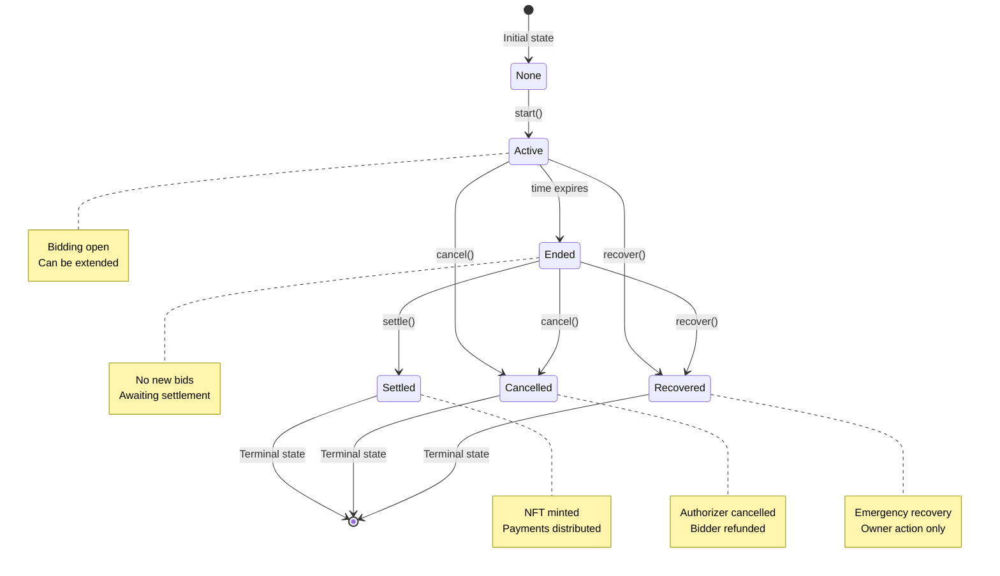

# Collectible Casts

A new way for Farcaster users to financially support creators through collectible NFTs.

## Overview

Collectible Casts introduce a simple mechanism where every cast can be _collected_. If more than one user attempts to collect the same cast within the bidding window, an ascending auction determines the final owner and price. The winning bidder receives an ERC-721 token representing the collectible, minted directly to their wallet. Ninety percent of the winning bid goes to the creator; the remaining ten percent accrues to the protocol treasury for growth incentives.

## Goals

- **Creator monetization** - Let any creator earn immediately from their content without waiting for weekly reward cycles
- **Showcase support** - Give users a collectible that is more meaningful than a tip and shareable across wallets and profiles
- **Simplicity first** - Ship a minimal, auditable contract suite that we fully understand and simple core dependencies
- **Extensible periphery** - Make experimentation with auction parameters easy without deploying new contracts. Make deploying new auction contracts possible.
- **Ossify NFT metadata** - Start with offchain metadata but make it possible to progressively ossify.

## Non-Goals

- A fully-featured secondary marketplace at launch
- Perfect royalty enforcement across all venues
- Support for arbitrary ERC-20 payment tokens (USDC hardcoded for v1)
- Highly onchain token metadata
- Extreme gas efficiency

## Architecture

Two main contracts work together:

```
┌─────────────────┐    mints    ┌─────────────────┐
│    Auction      │ ──────────▶ │ CollectibleCasts│
│                 │             │   (ERC-721)     │
│ • USDC escrow   │             │ • NFT management│
│ • Bid tracking  │             │ • Royalties     │
│ • Settlement    │             │ • Metadata      │
└─────┬───────────┘             └─────────────────┘
      │ escrow
      ▼
┌─────────────────┐
│   USDC Token    │
│   (Base)        │
└─────────────────┘
```

### Auction Flow

1. **Start**: A backend signer authorizes auction creation via EIP-712 signature, signing over the initial auction parameters and bid.
2. **Bidding**: Users place competing bids with automatic refunds. Bids must be submitted with an offchain authorizer signature.
3. **Anti-snipe**: Auction end time is extended for new bids placed near end. Parameters are configurable at auction start time.
4. **Settlement**: When ended, anyone can settle to mint NFT and distribute payments.
5. **Cancellation**: Auctions can be cancelled when active or ended with a signature from an offchain authorizer.
6. **Emergency Recovery**: Contract owner can recover funds from stuck auctions (e.g., USDC blacklisted addresses) to a specified address.

### Auction State Transitions



## Quick Start

```bash
# Install Foundry
curl -L https://foundry.paradigm.xyz | bash
foundryup

# Clone and setup
git clone https://github.com/farcasterxyz/collectible-casts
cd collectible-casts
forge install

# Build and test
forge build
forge test
```

## Development

### Testing

```bash
# Run all tests
forge test

# Run with gas reporting
forge test --gas-report

# Run with coverage
forge coverage

# Fuzz testing profiles
forge test                    # Default: 2,048 runs
FOUNDRY_PROFILE=ci forge test # CI: 10,000 runs
FOUNDRY_PROFILE=deep forge test # Deep: 50,000 runs
```

### Code Quality

```bash
# Format code (120 char lines)
forge fmt

# Check formatting
forge fmt --check

# Generate documentation
forge doc

# Contract size analysis
forge build --sizes
```

## Deployment

### Environment Setup

Required environment variables:

```bash
export DEPLOYER_ADDRESS=<your-deployer-address>
export OWNER_ADDRESS=<contract-owner-address>
export TREASURY_ADDRESS=<protocol-treasury>
export BACKEND_SIGNER_ADDRESS=<backend-authorizer>
export BASE_URI=<metadata-base-uri>
```

### Deploy to Base

```bash
# Base Mainnet
forge script script/DeployCollectibleCasts.s.sol \
  --rpc-url $BASE_RPC_URL \
  --private-key $PRIVATE_KEY \
  --broadcast \
  --verify

# Base Sepolia (testnet)
forge script script/DeployCollectibleCasts.s.sol \
  --rpc-url $BASE_SEPOLIA_RPC_URL \
  --private-key $PRIVATE_KEY \
  --broadcast
```

The deployment script uses CREATE2 for deterministic addresses and automatically configures permissions and parameters.

## System Design

### Core Components

**CollectibleCasts (ERC-721)**

- Stores cast metadata (creator FID, address)
- Implements ERC-2981 royalties (5% to creator)
- Restricts minting to authorized auction contract
- Supports custom metadata URIs per token

**Auction**

- Manages USDC escrow for all active auctions
- Validates EIP-712 signatures from backend authorizers
- Handles bid tracking with automatic refunds
- Settles auctions by minting NFTs and distributing payments

### Key Mechanisms

**Token ID Derivation**: `uint256(castHash)` ensures deterministic minting

**Bid Validation**:

- Minimum increments: 10% or 1 USDC (whichever greater)
- Maximum duration: 30 days (configurable in contract)
- Auction parameters configurable per auction

**Payment Flow**:

- Bids held in escrow until settlement
- Protocol fee configurable (likely 10%)
- Remainder goes to cast creator
- Failed bidders automatically refunded on outbid

**Authorization**:

- All auction operations require EIP-712 signatures from an offchain "authorizer"
- Multiple backend signers supported via allowlist
- Random nonce for replay protection

## Documentation

- **[SPEC.md](./SPEC.md)** - Notes from original spec
- **[CLAUDE.md](./CLAUDE.md)** - Notes for our buddy Claude
