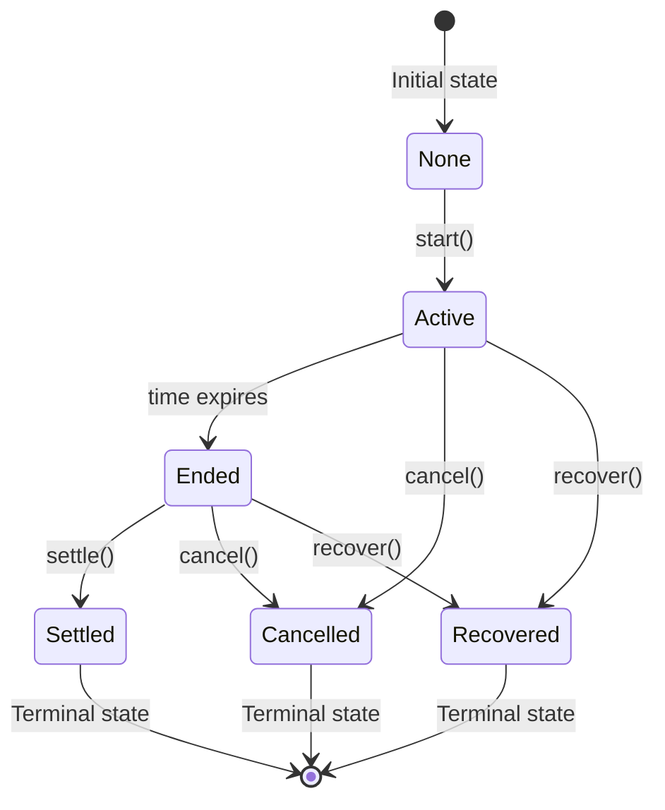

# Collectible Casts

A new way for Farcaster users to financially support creators through collectible NFTs.

## Overview

Collectible Casts introduce a mechanism where every cast can be _collected_. If more than one user attempts to collect the same cast within the bidding window, an ascending auction determines the final owner and price. The winning bidder receives an ERC721 token representing the collectible, minted directly to their wallet. 90% of the winning bid goes to the creator; the remaining 10% accrues to the protocol treasury for growth incentives.

## Goals

- **Creator monetization** - Let any creator earn immediately from their content without waiting for weekly reward cycles
- **Showcase support** - Give users a collectible that is more meaningful than a tip and shareable across wallets and profiles
- **Simplicity first** - Ship minimal contracts that we fully understand with few core dependencies
- **Start permissioned** - Restrict initial auctions to Farcaster users
- **Changeable periphery** - Make experimentation with auction parameters very easy. Make deploying new auction contracts pretty easy.
- **Ossify NFT metadata** - Start with offchain metadata but make it possible to progressively ossify.

## Non-Goals

- Our own secondary marketplace at launch
- Perfect royalty enforcement across all marketplaces
- Multiple clients at launch
- Gasless bidding at launch
- Support for arbitrary ERC20 payment tokens (Base USDC only)
- Extremely onchain token metadata
- Extreme gas efficiency

## Architecture

Two contracts, `Auction` and `CollectibleCasts`:

```
┌─────────────────┐    mints    ┌─────────────────┐
│    Auction      │ ──────────▶ │ CollectibleCasts│
│                 │             │   (ERC-721)     │
│ • USDC escrow   │             │ • NFT management│
│ • Bid tracking  │             │ • Royalties     │
│ • Settlement    │             │ • Metadata      │
└─────┬───────────┘             └─────────────────┘
      │ escrow
      ▼
┌─────────────────┐
│   USDC Token    │
│   (Base)        │
└─────────────────┘
```

### Auction Flow

**Start**:
A backend signer authorizes auction creation with an EIP712 signature, signing over the initial auction parameters and bid. This enables us to change some auction parameters (min bid amount, min increment, fee split, duration, extension time, extension threshold) from the Farcaster app backend and set different policies for new vs historical casts. Auctions start on first bid and the initial bid must provide this authorization signature from the backend.

**Bidding**:
Users place ascending USDC bids with automatic refunds. New bids must be the greater of an absolute min bid amount and min bid increment in BPS. Each bid must be submitted with an offchain authorizer signature. This allows us to restrict bids to Farcaster users. Users who are outbid are automatically refunded.

**Extension**:
The auction's end time is extended when new bids are placed near the end. These parameters are configurable by the offchain authorizer at auction start time.

**Settlement**:
Once ended, anyone can settle an auction. This distributes payment and mints the collectible NFT to the winner. We intend to run batch settlement jobs to settle auctions for app users.

**Cancellation**:
Offchain authorizers can cancel Active and Ended auctions before they are Settled. They will do this in the event that a cast is deleted or a user opts out of collectible casts.

**Emergency Recovery**:
In the event of a stuck auction, owner can "recover" an auction, cancelling it and sending funds to a specified address instead of the high bidder.

## Assumptions and Acknowledgments

- Auctions will always use Base USDC. No weird ERC20s. No native ETH bidding.
- "Push" refunds have some edge case risk in the event that a bidder is blacklisted by the USDC contract.

### Auction State Transitions



## Quick Start

```bash
# Install Foundry
curl -L https://foundry.paradigm.xyz | bash
foundryup

# Clone and setup
git clone https://github.com/farcasterxyz/collectible-casts
cd collectible-casts
forge install

# Build and test
forge build
forge test
```

## Development

### Testing

```bash
# Run all tests
forge test

# Run with gas reporting
forge test --gas-report

# Run with coverage
forge coverage

# Fuzz testing profiles
forge test                    # Default: 2,048 runs
FOUNDRY_PROFILE=ci forge test # CI: 10,000 runs
FOUNDRY_PROFILE=deep forge test # Deep: 50,000 runs
```

### Code Quality

```bash
# Format code (120 char lines)
forge fmt

# Check formatting
forge fmt --check

# Generate documentation
forge doc

# Contract size analysis
forge build --sizes
```

## Deployment

### Environment Setup

Required environment variables:

```bash
export DEPLOYER_ADDRESS=<your-deployer-address>
export OWNER_ADDRESS=<contract-owner-address>
export TREASURY_ADDRESS=<protocol-treasury>
export BACKEND_SIGNER_ADDRESS=<backend-authorizer>
export BASE_URI=<metadata-base-uri>
```

### Deploy to Base

```bash
# Base Mainnet
forge script script/DeployCollectibleCasts.s.sol \
  --rpc-url $BASE_RPC_URL \
  --private-key $PRIVATE_KEY \
  --broadcast \
  --verify

# Base Sepolia (testnet)
forge script script/DeployCollectibleCasts.s.sol \
  --rpc-url $BASE_SEPOLIA_RPC_URL \
  --private-key $PRIVATE_KEY \
  --broadcast
```

The deployment script uses CREATE2 for deterministic addresses and automatically configures permissions and parameters.

## Documentation

- **[SPEC.md](./SPEC.md)** - Notes from original spec
- **[CLAUDE.md](./CLAUDE.md)** - Notes for our buddy Claude
